# 🏗️ System Architecture

**Project**: Lingotran Vocalis - Multi-Modal Speech Platform  
**Date**: January 16, 2026  
**Status**: Implemented & Production Ready

---

### 1. Agent Mode (LiveKit WebRTC)

**The Modern Standard**
*   **Protocol:** WebRTC (UDP/TCP) via LiveKit SFU.
*   **Data Flow:** Client Audio Track -> LiveKit Server -> Python Worker (Plugin) -> Whisper.
*   **Latency:** Ultra-Low (<300ms network latency).
*   **Features:** Built-in VAD context, interruption handling, and robust networking (packet loss concealment).

### 2. Direct Mode (WebSocket)
**The Lightweight P2P**

```mermaid
graph LR
    Mic[🎤 Microphone] -- MediaRecorder --> WS[🔌 WebSocket];
    WS -- "Binary Chunks (WebM)" --> API[⚡ FastAPI Endpoint];
    API -- "FFmpeg Conv" --> WAV[🎵 WAV Audio];
    WAV -- "Energy Gate" --> VAD{🔊 VAD Check};
    VAD -- "Silence" --> Drop[🗑️ Discard];
    VAD -- "Speech" --> Whisper[🧠 Whisper Small];
    Whisper -- "Text" --> UI[📱 Frontend UI];
    style Mic fill:#fff,stroke:#333
    style VAD fill:#fff9c4,stroke:#fbc02d
    style Whisper fill:#e3f2fd,stroke:#1565c0
```

*   **Protocol:** WebSocket (TCP).
*   **Data Flow:** Client MediaRecorder -> Blob (WebM) -> FastAPI Endpoint -> FFmpeg -> Whisper.
*   **Latency:** Low-Medium (Dependent on chunk size, currently 500ms chunks).
*   **Features:** Simple implementation, no external infrastructure required.

### 3. Hybrid Mode (Legacy)
**The Experimental Bridge**
*   **Protocol:** LiveKit (for Room State) + WebSocket (for Audio Data).
*   **Purpose:** Deprecated/Legacy mode used during initial migration.

---

## 🛠️ Backend Design (Python/FastAPI)

The backend (`main.py`) is a unified server handling both protocols concurrently.

### 🧠 Inference Engine
*   **Model:** `faster-whisper` (Small, Int8 Quantization)
*   **Optimization:** Running on CPU with VAD (Voice Activity Detection) pre-filtering.
*   **Hallucination Guard:**
    *   **Input:** Energy Gate (-40dB) rejects silence.
    *   **Process:** VAD Filter (250ms min duration).
    *   **Output:** Text Post-processing (Blocklist for "Thank you", "Amara.org").

### 🔄 Concurrency Model
*   **WebSockets:** Handled via FastAPI's `async/await` event loop.
*   **LiveKit Workers:** Managed by `livekit-agents` worker pool, running in separate threads/processes to prevent blocking the WebSocket loop.

---

## 📱 Frontend Design (React/Vite)

### 🧩 Component Hierarchy
*   **PageLayout:** Common shell with Theme Toggle, Navigation.
*   **SystemCheckModal:** Pre-flight diagnostics (Mic, Socket, API).
*   **Mode Pages:**
    *   `LiveKitTestMode.tsx` (Agent)
    *   `WebSocketMode.tsx` (Direct)
*   **Visualizers:**
    *   `AudioVisualizer.tsx`: Canvas-based real-time frequency/amplitude rendering.
    *   `VantaBackground.tsx`: WebGL atmospheric background.

### 🛡️ Mobile & Security
*   **Responsive:** TailwindCSS Grid (One col mobile, Two col desktop).
*   **Tunneling:** Dev-mode support for **Ngrok** to allow HTTPS microphone access on iOS/Android.

---

## 📊 Performance Benchmark

| Metric               | Agent Mode (LiveKit)         | Direct Mode (WS)          |
| :------------------- | :--------------------------- | :------------------------ |
| **Transport**        | WebRTC (UDP)                 | WebSocket (TCP)           |
| **Network Overhead** | Low (Optimized Opus)         | Medium (WebM headers)     |
| **Server Load**      | Medium (Worker Threads)      | Low (Async IO)            |
| **Real-World TAT**   | **~0.4s - 0.8s**             | **~0.6s - 1.2s**          |
| **Reliability**      | High (Reconnection handling) | Medium (TCP HoL Blocking) |

---

## 🔮 Future Roadmap

1.  **Speaker Diarization:** Identify *who* is speaking in Agent Mode.
2.  **LLM Integration:** Feed transcript into streaming LLM (GPT-4o) for conversational AI.
3.  **GPU Acceleration:** Support for `large-v3` model on CUDA.

