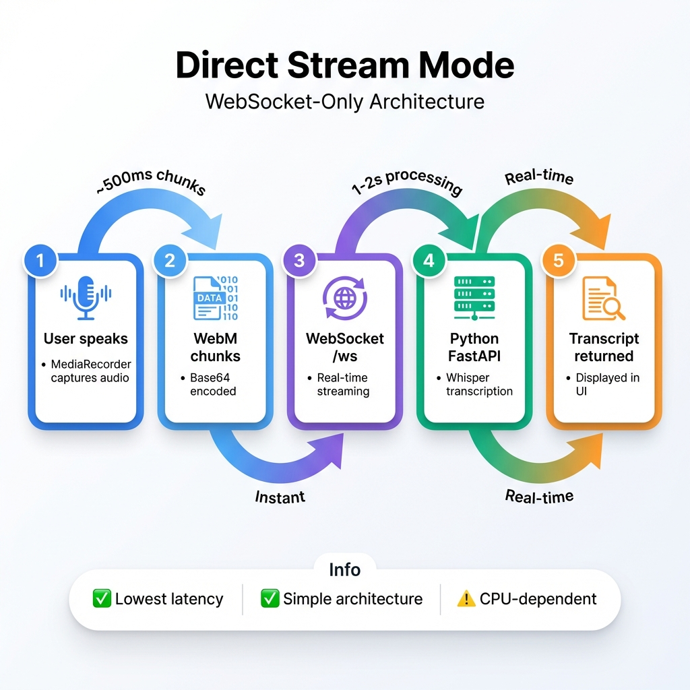
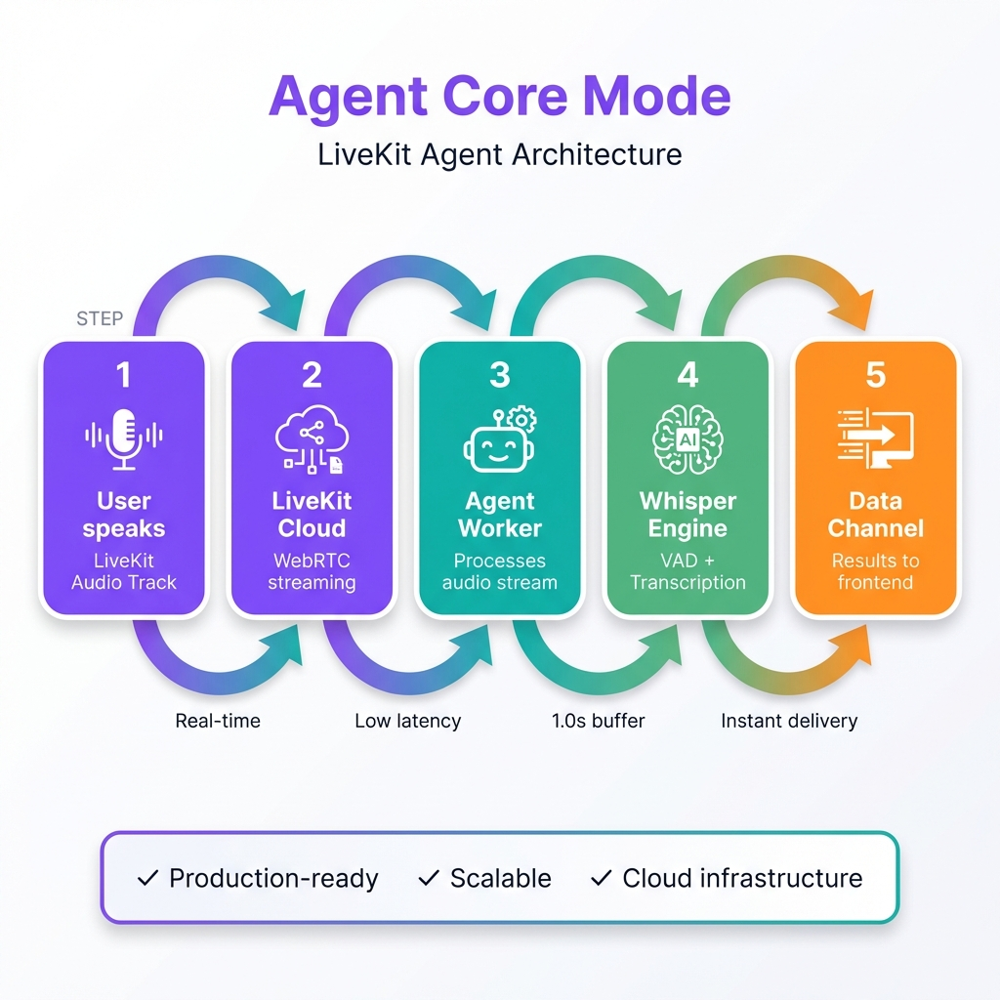
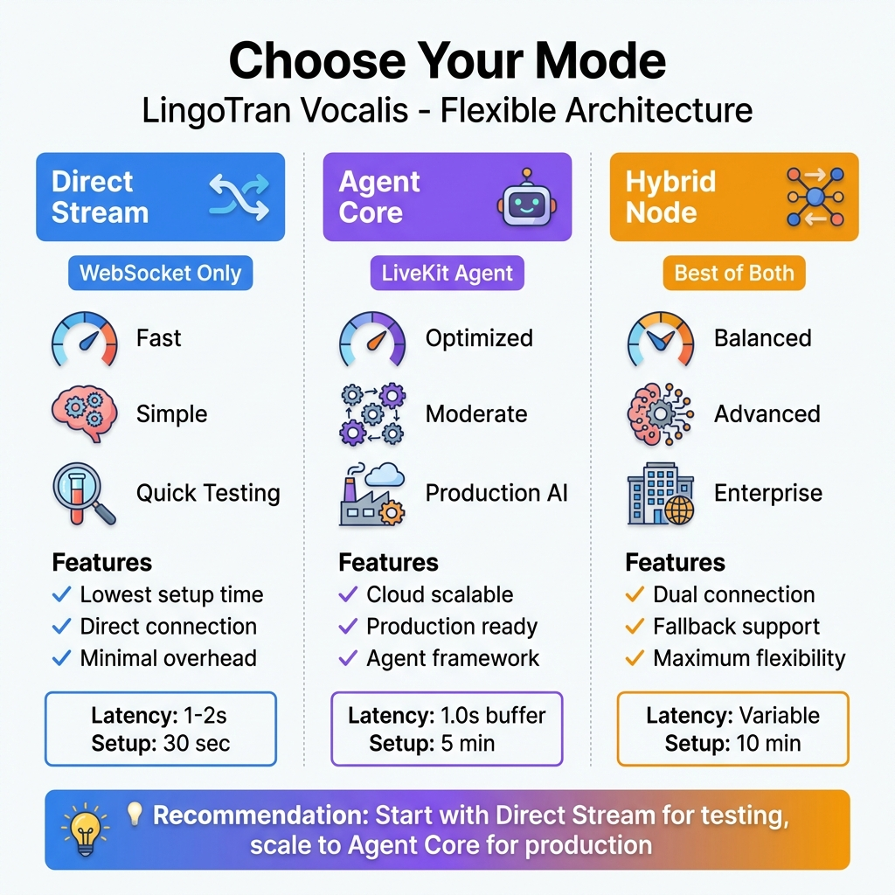
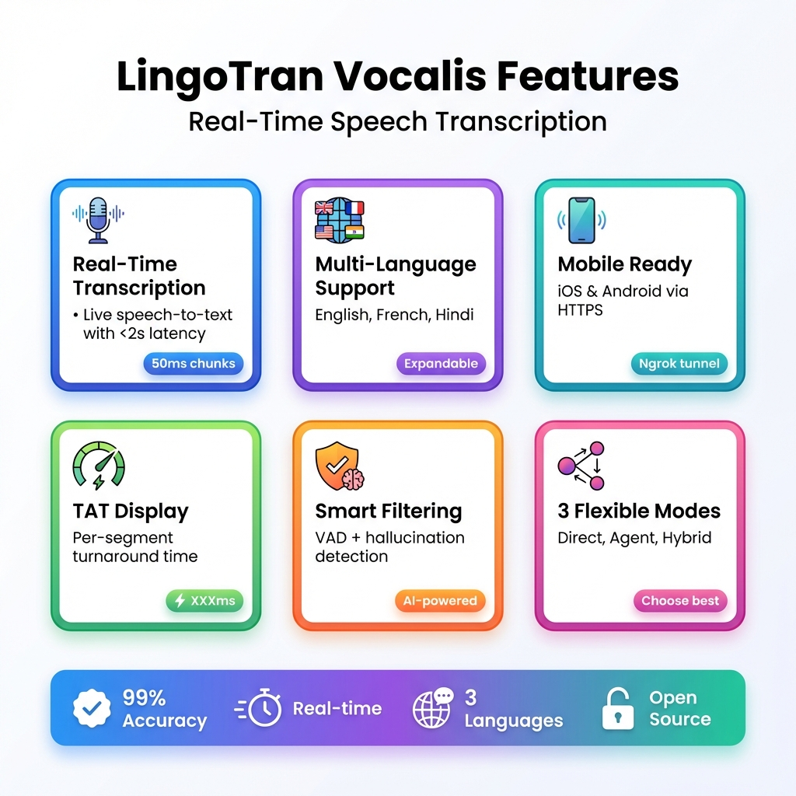

# 🎨 Visual Documentation Gallery

Welcome to the LingoTran Vocalis visual documentation! All diagrams are professional HD infographics with modern design.

---

## 📊 System Architecture

**Overview:** Complete system architecture showing Frontend (React), Communication layer (WebSocket +LiveKit), and Backend (FastAPI + Whisper) with performance metrics.

---

## 🔄 Mode Diagrams

### Direct Stream Mode

**Flow:** User Mic → MediaRecorder → WebSocket → FastAPI → Whisper → UI  
**Best For:** Quick testing, lowest latency

### Agent Core Mode

**Flow:** User Mic → LiveKit Track → Cloud → Agent Worker → Whisper → Data Channel  
**Best For:** Production deployments, scalable architecture

---

## 🆚 Mode Comparison

**Comparison:** Side-by-side feature comparison of all three modes (Direct Stream, Agent Core, Hybrid Node) with latency stats and use cases.

---

## ✨ Features Overview

**Highlights:**
- Real-Time Transcription (<2s latency)
- Multi-Language Support (EN/FR/HI)
- Mobile Ready (iOS & Android)
- TAT Display (per-segment timing)
- Smart Filtering (VAD + hallucination detection)
- 3 Flexible Modes

---

## 📁 Image Files

All images are saved in `docs/images/`:
- `system_architecture.png` - Full system diagram
- `direct_mode.png` - Direct Stream Mode flow
- `agent_mode.png` - Agent Core Mode flow  
- `mode_comparison.png` - Mode comparison chart
- `features_overview.png` - Features grid

**Format:** PNG (HD quality, 1920x1080)  
**Style:** Modern flat design, white background, colorful accents  
**Usage:** README, presentations, documentation

---

## 🎨 Design Specifications

**Color Palette:**
- Primary Blue: `#3B82F6`
- Success Green: `#10B981`
- Purple Accent: `#8B5CF6`
- Warning Orange: `#F59E0B`
- Error Red: `#EF4444`
- Background: `#FFFFFF`

**Typography:**
- Headers: Sans-serif, bold, modern
- Body: Clean, readable sans-serif
- Code: Monospace

**Style:**
- Clean white backgrounds
- Soft shadows for depth
- Rounded corners (8-12px)
- Gradient accents
- Icon-first design

---

**Last Updated:** 2026-01-16  
**Maintainer:** Development Team
